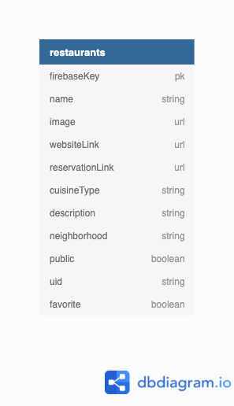

#&#10024; Nashville Night Out &#10024;

#### Overview
Nashville Night Out is an app where authenticated users can log Nashville restaurants to help them keep track of where they would like to eat. Once authenticated, users will have the option to add their own restaurants along with the name, image URL, short description, website URL, reservation URL, cuisine type, and neighborhood of that restaurant. There will also be an option to check if they have visited or if it is a favorite. With the Let's Eat feature, clicking a button will give the user a random restaurant from their list.

#### Deployed Link [](https://app.netlify.com/sites/nashville-night-out/deploys)
[Nashville Night Out](https://nashville-night-out.netlify.app/)

#### Motivation
Nashville is quickly becoming a foodie town. As someone who likes to visit new restaurants, I have a hard time choosing which one to try out as there are so many to choose from. With the help of this app, I have a way to log them to keep track of where I have and haven't been. With the Let's Eat randomizer feature, I now have the option to never ask "Where should we eat tonight?" ever again as a restauruant will be chosen for me.
#### ERD
[Link](https://dbdiagram.io/d/60b16368b29a09603d170c69)



#### Wireframes
[Figma](https://www.figma.com/file/H11DfKviLNLKtqCrufo2Sz/Nashville-Night-Out?node-id=0%3A1)

#### Flowchart 
[Lucidchart](https://lucid.app/lucidchart/invitations/accept/inv_ad8032e6-3ee9-49c4-a554-60793c9fd485)

#### Project Board
[Link](https://github.com/lindseysatterfield/nashville-night-out/projects/1)
#### Features
- User authentication
- Responsive design
- Ability to create, read, update, and delete restaurants
- Alert when restaurant has been added
- Ability to select restaurants as 'visited' and 'favorite'
- Search by restaurant name
- All restaurants view
- Favorites view
- Let's Eat randomizer button to get a random restaurant
#### User Stories
###### MVP
- As a user, I should be able to add new restaurants
- As a user, I should be able to read, delete, and update my restaurants
- As a user, I should be able to get a random restaurant with the click of a button from my list of added restaurants
- As a user, I should be able to favorite a restaurant
- As a user, I should be able to select if I have visited the restaurant
- As a user, I should be able to search through restaurants by name

###### Stretch
- As a user, I should be able to filter restaurants based on cuisine or neighborhood
- As a user, I should be able to search reviews for restaurants from the Yelp API

#### Technologies
- React
- JavaScript
- HTML
- CSS
- Sass
- Bootstrap
- Reactstrap
- Firebase
- Webpack
- NPM
- Git
- Figma
#### Screenshots


#### Sample Data
```
{
  "cuisineType" : "American",
  "description" : "Located on the 34th floor of the JW Marriott Hotel, Bourbon Steak offers the best steak, seafood, and wine selection in Nashville",
  "favorite" : false,
  "firebaseKey" : "-MbRo79GOgyvoAunxm21",
  "image" : "https://d1t295ks1d26ah.cloudfront.net/media/pictures/files/000/015/270/xlarge_desktop/Bourbon_Steak_Nashville_food3.jpg?1535483295",
  "name" : "Bourbon Steak",
  "neighborhood" : "South Broadway",
  "reservationLink" : "https://nashvillebourbonsteak.com/#SevenRooms",
  "uid" : "jFuibhiuTDXWxmjyqvTiu64OBoR2",
  "websiteLink" : "https://nashvillebourbonsteak.com/"
  "visited" : false
}
```
#### Contributors
[Lindsey Satterfield](https://github.com/lindseysatterfield)

[Link to personal site](lindseysatterfield.com)
#### Video Walkthrough
[Loom]()
