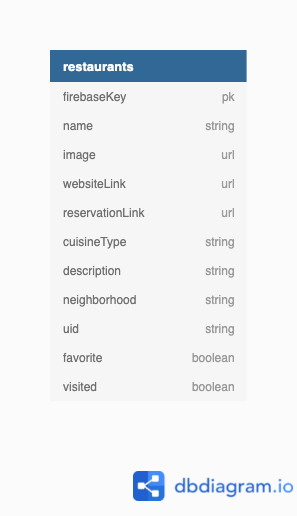

# 	&#10024; Nashville Night Out &#10024;

#### Overview
Nashville Night Out is an app where authenticated users can click a button to then receive a random restaurant in Nashville. The town has so many restaurants to choose from and this will help users from having to ask, "Where should we eat tonight?" The user will also have an option to add/update/delete a restaurant and favorite a restaurant. The restaurant card will include restaurant name, image, link to their website, link to a reservation site, description, type of cuisine, and location area.  When the user favorites a restaurant, it will be on their 'Favorites' view. There will also be a 'View Restaurants' view that will show the user all the added restaurants.

#### Deployed Link [](https://app.netlify.com/sites/nashville-night-out/deploys)
[Nashville Night Out](https://nashville-night-out.netlify.app/)

#### Motivation
Nashville is quickly becoming a foodie town. As someone who likes to visit new restaurants, I have a hard time choosing which one to try out as there are so many to choose from. With the help of this app, all the hard work of picking a restaurant will be done for me as a different one will be sent to me with only the click of a button.
#### ERD
[Link](https://dbdiagram.io/d/60b16368b29a09603d170c69)



#### Wireframes
[Figma](https://www.figma.com/file/H11DfKviLNLKtqCrufo2Sz/Nashville-Night-Out?node-id=0%3A1)

#### Flowchart 
[Lucidchart](https://lucid.app/lucidchart/invitations/accept/inv_ad8032e6-3ee9-49c4-a554-60793c9fd485)

#### Project Board
[Link](https://github.com/lindseysatterfield/nashville-night-out/projects/1)
#### Features

#### User Stories
###### MVP
- As a user, I should be able to add new restaurants
- As a user, I should be able to read, delete, and update my restaurants
- As a user, I should be able to get a random restaurant with the click of a button from my list of added restaurants
- As a user, I should be able to favorite a restaurant
- As a user, I should be able to mark if I have visited the restaurant
- As a user, I should be able to search through restaurants by name

###### Stretch
- As a user, I should be able to filter restaurants based on cuisine or neighborhood
- As a user, I should be able to search reviews for restaurants from the Yelp API

#### Technologies
#### Screenshots


#### Sample Data
```
{
  "cuisineType" : "American",
  "description" : "Located on the 34th floor of the JW Marriott Hotel, Bourbon Steak offers the best steak, seafood, and wine selection in Nashville",
  "favorite" : false,
  "firebaseKey" : "-MbRo79GOgyvoAunxm21",
  "image" : "https://d1t295ks1d26ah.cloudfront.net/media/pictures/files/000/015/270/xlarge_desktop/Bourbon_Steak_Nashville_food3.jpg?1535483295",
  "name" : "Bourbon Steak",
  "neighborhood" : "South Broadway",
  "reservationLink" : "https://nashvillebourbonsteak.com/#SevenRooms",
  "uid" : "jFuibhiuTDXWxmjyqvTiu64OBoR2",
  "websiteLink" : "https://nashvillebourbonsteak.com/"
  "visited" : false
}
```
#### Contributors
[Lindsey Satterfield](https://github.com/lindseysatterfield)

[Link to personal site](lindseysatterfield.com)
#### Video Walkthrough
[Loom]()
